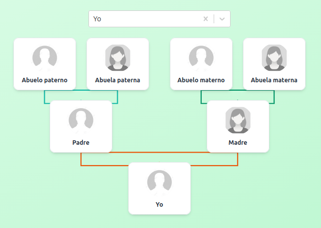
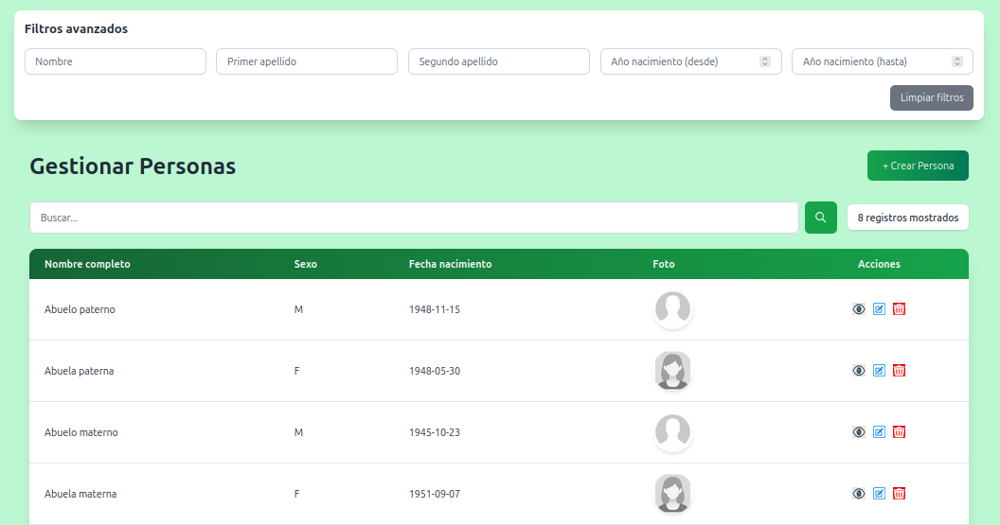
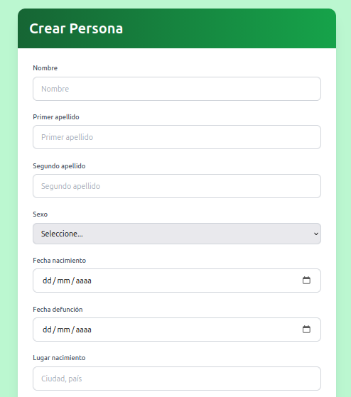
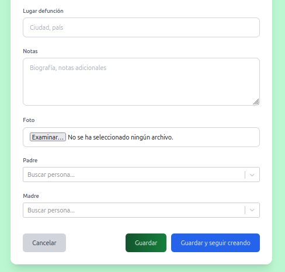
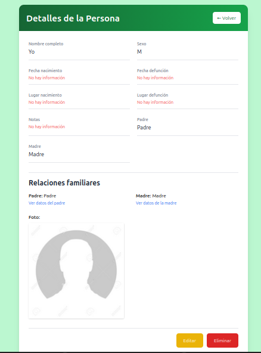
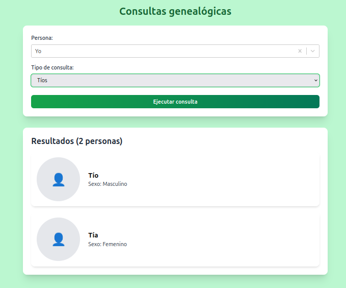
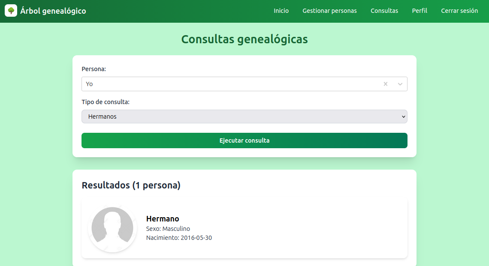

# 🌳 Árbol Genealógico

## Aplicación web para la gestión y visualización de árboles genealógicos.

Permite registrar personas, y establecer relaciones familiares (padre/madre)

## 🛠️ Tecnologías
Django Rest Framework en backend y React, Typescript y Tailwindcss en frontend

## Imágenes de la aplicación

**Árbol genealógico**

  

**Gestionar Personas**

  

**Crear Persona**

  

  

**Detalles de una persona**

  

**Consultas genealógicas**

 

   